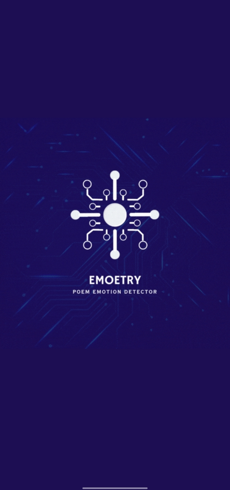
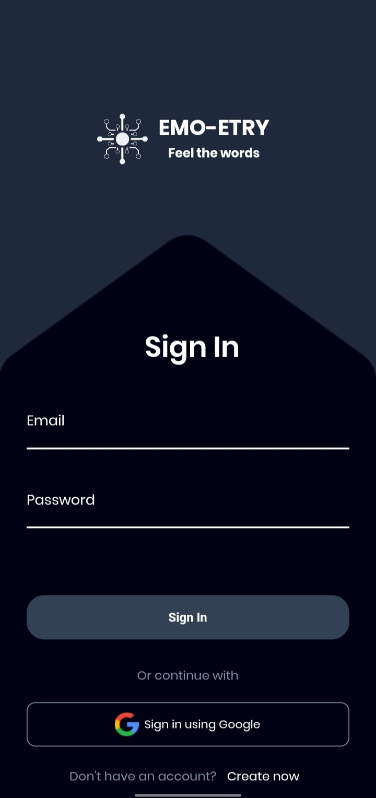
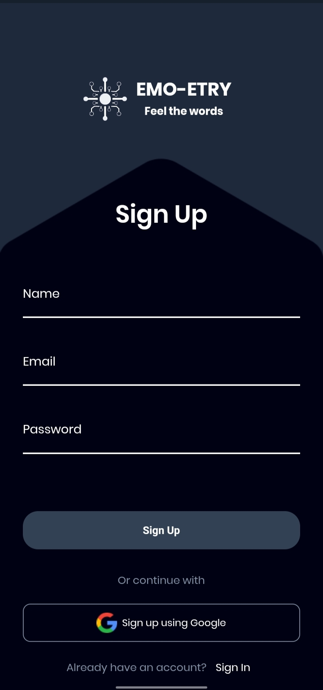
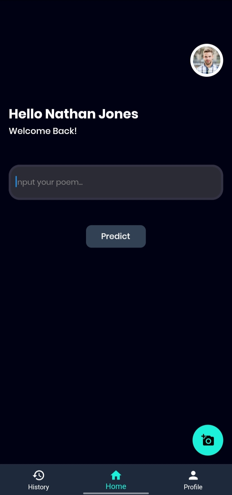
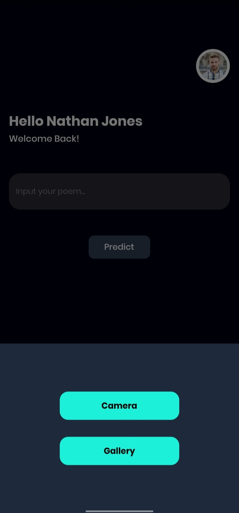
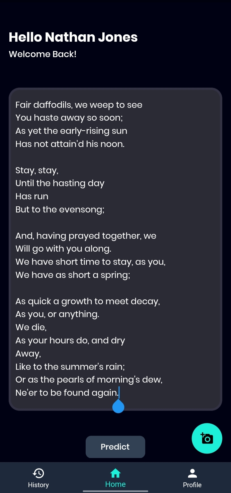
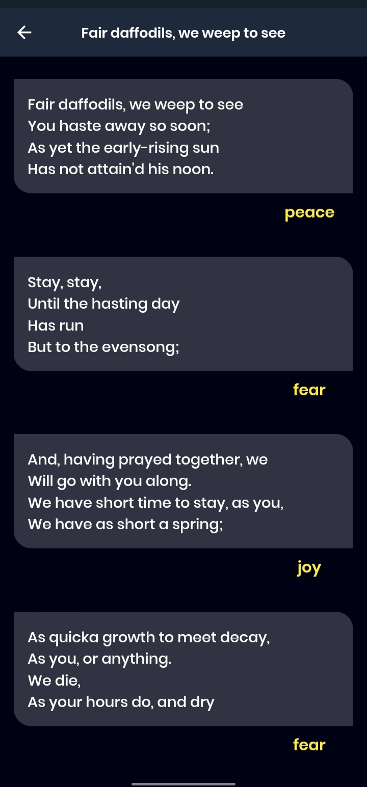
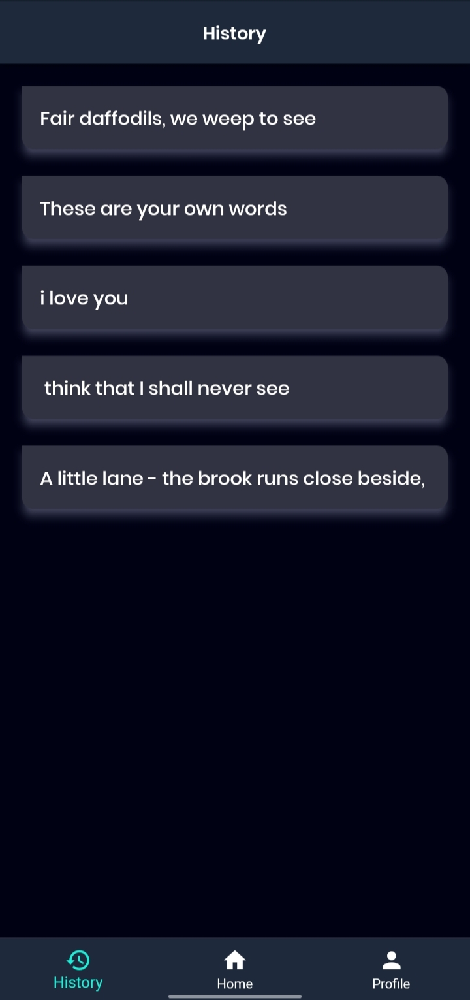
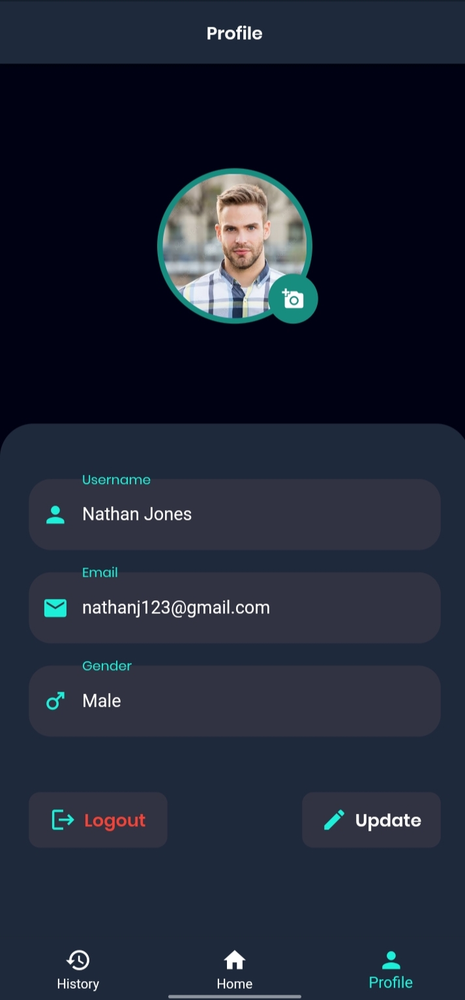

# Poem Emotion Detection Mobile App (NLP-based Machine Learning Project)

## Table of Contents
- [Introduction](#introduction)
- [Features](#features)
- [Usage](#usage)
- [Machine Learning Model](#machine-learning-model)
- [API Endpoints](#api-endpoints)
- [Technologies Used](#technologies-used)
- [Server Setup](#server-setup)
- [Installation](#installation)
- [Contributing](#contributing)
- [License](#license)

## Introduction
The Poem Emotion Detection Mobile App is an NLP-based machine learning project built using Flutter for the front-end, Flask for the server, and Firebase for the backend. The app allows users to analyze the emotions expressed in poems and provides a platform to save and review their analyzed poems.

## Features
- User authentication with options to register or log in using their Gmail ID.
- Manual text input or image upload to extract the poem's text.
- Emotion prediction for each stanza using the Passive Aggressive Classifier (PAC) machine learning algorithm.
- Visualization of the poem divided into stanzas with corresponding detected emotions.
- Save poems to the Firebase database for future reference.
- User dashboard displaying user details and the option to upload a profile picture.

## Usage
1. Launch the app and log in using your registered email address or Gmail ID.
2. Input a poem's text manually into the provided textarea or upload an image of the poem from your phone gallery.
3. Click the "Predict" button to trigger the emotion prediction for each stanza.
4. View the results screen, which displays the poem divided into stanzas with their corresponding detected emotions.
5. Save the poem by clicking the "Save" button, which stores it in the Firebase database accessible from the history screen.
6. Customize your user dashboard by uploading a profile picture from the gallery and saving the changes.

## Machine Learning Model
The machine learning algorithm used in this app is the Passive Aggressive Classifier (PAC), which achieved an accuracy of approximately 65.463% during testing.

## API Endpoints
The Flask API has the following endpoint:

**POST /predict_poem_emotion**: This endpoint takes a stanza as input, predicts its emotion using the PAC model, and returns the JSON response containing the emotion.

## Technologies Used
The Poem Emotion Detection Mobile App leverages the following technologies:

- Flutter
- Flask
- Python
- Machine learning (Scikit-learn)
- Natural Language Processing (NLTK)
- Regex
- Firebase

## Server Setup
Before running the Flask server for the first time, ensure that the following packages are installed:

- `pip install sklearn`
- `pip install nltk`
- `pip install re`

## Installation
To install the app on your device, follow these steps:

1. Clone the repository: `git clone https://github.com/your-repo-url.git`
2. Navigate to the app directory: `cd poem_emotion_detection_app`
3. Install Flutter dependencies: `flutter pub get`
4. Run the app: `flutter run`

## Screenshots
Here are some screenshots of the Poem Emotion Detection Mobile App:

## Contributing
Contributions to the Poem Emotion Detection Mobile App project are welcome! If you find any issues or have ideas for improvements, please open an issue or create a pull request.

## License
This project is licensed under the [MIT License](LICENSE). Feel free to use, modify, or distribute the code for your purposes.
